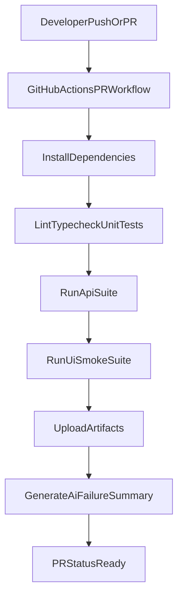
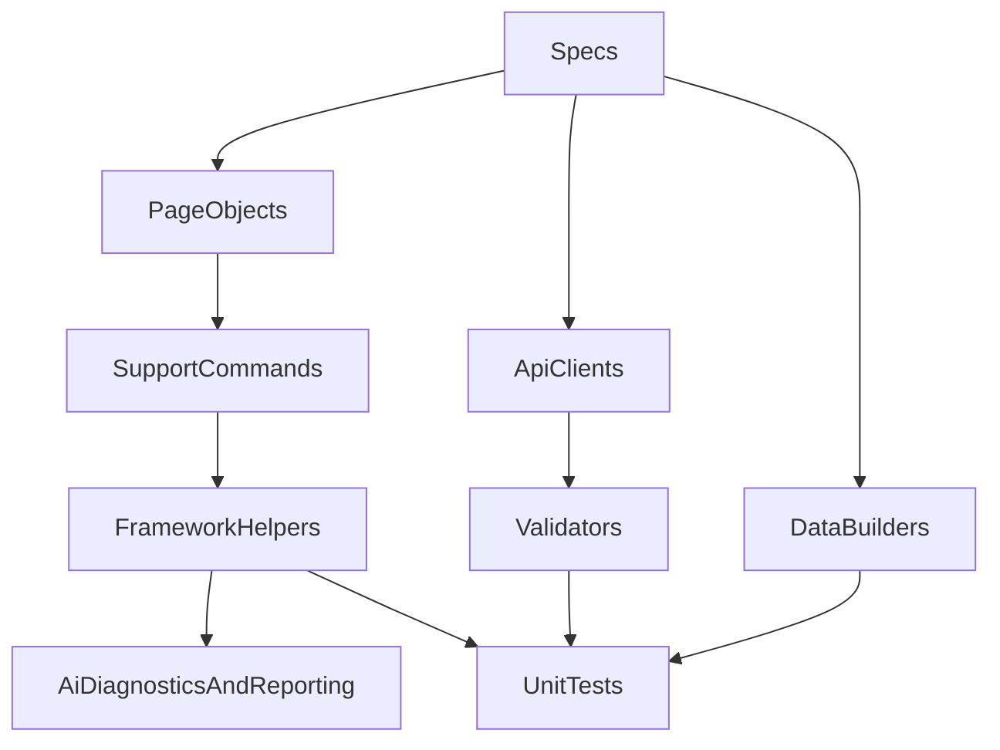

# ATF Cypress Framework

A production-style Cypress automation framework built with TypeScript, Page Object Model (POM), API testing, framework unit tests, and CI quality gates.

## Goals
- Keep tests readable while centralizing selectors/actions in page objects.
- Separate framework logic into unit-testable modules.
- Cover both UI and API behavior with stable, maintainable suites.
- Add optional AI-assisted failure triage without making the framework dependent on AI.

## Tech Stack
- Cypress (UI + API)
- TypeScript
- Mocha + Chai (framework unit tests)
- ESLint + Prettier
- GitHub Actions

## Dependencies
### System prerequisites
- Node.js `20+` (LTS recommended)
- npm `10+`

### Project dev dependencies
- `cypress`
- `typescript`, `ts-node`, `@types/node`
- `eslint`, `@eslint/js`, `@typescript-eslint/parser`, `@typescript-eslint/eslint-plugin`, `eslint-plugin-cypress`, `eslint-config-prettier`
- `prettier`
- `mocha`, `chai`, `@types/mocha`, `@types/chai`
- `fast-xml-parser` (AI failure summary parser)

## Project Structure
- `cypress/e2e/ui` UI specs (20 tests)
- `cypress/e2e/api` API specs (10 tests)
- `cypress/pages` page objects
- `cypress/support` custom commands and API clients
- `cypress/fixtures` shared fixture data
- `src/framework` framework utilities, validators, AI helpers
- `tests/unit` unit tests for framework modules
- `.github/workflows` PR workflows

## Architecture Strategy
1. **POM first**: page objects own selectors and interactions.
2. **Assertions near tests**: specs keep scenario intent explicit.
3. **Reusable framework utilities**: put parsing/validation/builder logic in `src/framework`.
4. **Stable locator strategy**: prefer resilient selectors and centralized updates.
5. **Risk-based test split**: smoke paths for PR, broader paths for full runs.

## Workflow Diagram

## Framework Diagram

## Environment
Copy `.env.example` to `.env` and adjust as needed.

Key variables:
- `CYPRESS_BASE_URL` (default `https://demoqa.com`)
- `CYPRESS_API_BASE_URL` (default `https://reqres.in/api`)
- `AI_ENABLED` (`true` or `false`)
- `OPENAI_API_KEY` (optional)
- `OPENAI_MODEL` (default `gpt-4o-mini`)

## Quick Start
1. Install dependencies:
   - `npm install`
2. Install Cypress binary (first time only):
   - `npx cypress install`
3. Create environment file:
   - `cp .env.example .env`
4. Verify quality gates:
   - `npm run lint`
   - `npm run typecheck`
   - `npm run test:unit`
5. Start the project / run tests:
   - Interactive runner: `npm run cy:open`
   - Headless UI suite: `npm run test:ui`
   - Headless API suite: `npm run test:api`

## Local PR Gate
Run the same main checks used before PR validation:
- `npm run test:pr`

## Commands
- `npm run cy:open` open Cypress runner
- `npm run test:ui` run all UI tests
- `npm run test:ui:smoke` run PR smoke UI tests
- `npm run test:api` run API tests
- `npm run test:unit` run framework unit tests
- `npm run lint` lint project
- `npm run typecheck` TypeScript checks
- `npm run ai:summary` generate failure summary from JUnit XML
- `npm run test:pr` full local PR gate sequence

### Environment-based Cypress start scripts
- `npm run cy:open:local`
- `npm run cy:open:develop`
- `npm run cy:open:beta`
- `npm run cy:open:alpha`
- `npm run cy:run:local`
- `npm run cy:run:develop`
- `npm run cy:run:beta`
- `npm run cy:run:alpha`

## Test Targets
- UI target: [DemoQA](https://demoqa.com)
- API target: [ReqRes](https://reqres.in)

## AI Connection (Pragmatic by design)
The framework includes optional AI helpers:
- **Failure triage summary** (`scripts/ai-summary.ts`): summarizes failing test output.
- **Selector diagnostics** (`src/framework/selectors/diagnostics.ts`): advisory recommendations for brittle locators.

When AI is disabled or no API key is present, the framework uses local deterministic summary logic.

## CI Before PR
GitHub Actions workflow: `.github/workflows/pr-tests.yml`
- Runs lint, typecheck, unit tests, API tests, and UI smoke tests on pull requests.
- Uploads screenshots/videos/results artifacts.
- Generates AI summary artifact on failures (non-blocking helper step).

## Clean Code Conventions
- Keep page objects focused on interaction methods and low-level selectors.
- Prefer explicit scenario names and concise assertion messages.
- Avoid hard-coding test data in specs; use builders/fixtures.
- Keep API clients reusable and centralized.
- Keep framework helpers pure where possible for easy unit testing.
